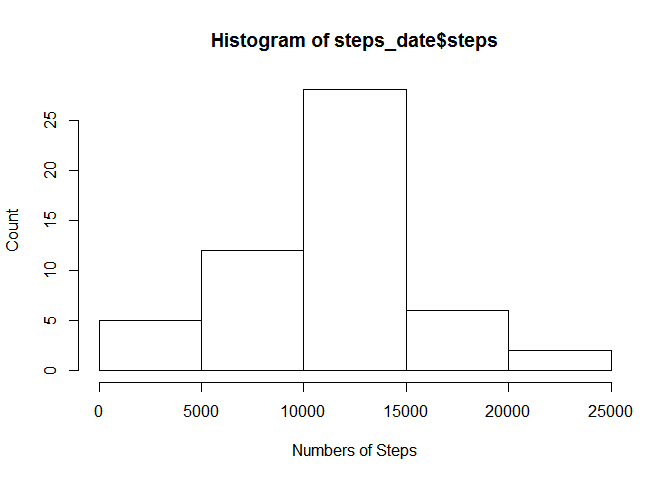
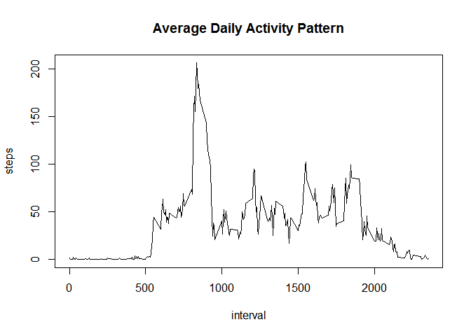
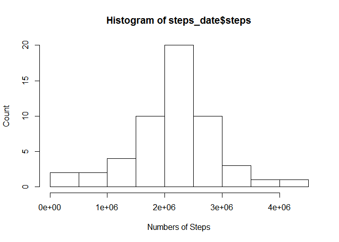
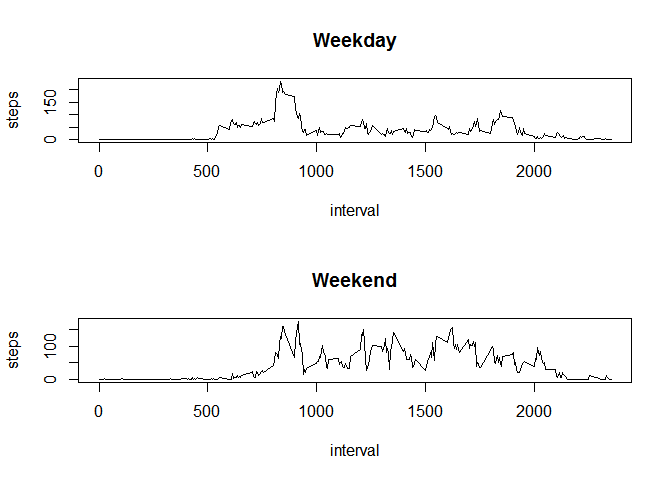

# Reproducible Research: Peer Assessment 1


## Loading and preprocessing the data

Read csv from the forked Github repository


```r
data <- read.csv(unz("activity.zip","activity.csv"))
```

## What is mean total number of steps taken per day?

Make a histogram of the total number of steps taken each day

```r
steps_date <- aggregate(steps ~ date, data = data, FUN = sum)
hist(steps_date$steps, xlab = "Numbers of Steps", ylab = "Count")
```

 

Calculate and report the mean and median total number of steps taken per day


```r
mean(steps_date$steps)
```

```
## [1] 10766
```

```r
median(steps_date$steps)
```

```
## [1] 10765
```

## What is the average daily activity pattern?

Make a time series plot (i.e. type = "l") of the 5-minute interval (x-axis) and the average number of steps taken, averaged across all days (y-axis)

```r
steps_interval <- aggregate(steps ~ interval, data=data, FUN=mean)
plot(steps_interval, type="l",main = "Average Daily Activity Pattern")
```

 

Which 5-minute interval, on average across all the days in the dataset, contains the maximum number of steps?

```r
steps_interval$interval[which.max(steps_interval$steps)]
```

```
## [1] 835
```

## Imputing missing values

Calculate and report the total number of missing values in the dataset (i.e. the total number of rows with NAs)

```r
sum(is.na(data$steps))
```

```
## [1] 2304
```

I use the mean for each day to fill in all the missing values in the dataset.

```r
data2 <- merge(data, steps_date, by="date")
nas <- data2$steps.x == 0
data2$steps.x[nas] <- data2$steps.y[nas]
data2 <- data2[ ,1:3]
colnames(data2)[2] <- "steps"
```

Make a histogram of the total number of steps taken each day and Calculate and report the mean and median total number of steps taken per day.


```r
steps_date <- aggregate(steps ~ date, data = data2, FUN = sum)
hist(steps_date$steps, xlab = "Numbers of Steps", ylab = "Count")
```

 

```r
mean(steps_date$steps)
```

```
## [1] 2177239
```

```r
median(steps_date$steps)
```

```
## [1] 2254724
```
Do these values differ from the estimates from the first part of the assignment? 
**YES, they do.**

What is the impact of imputing missing data on the estimates of the total daily number of steps? 
**They get much much bigger.**

## Are there differences in activity patterns between weekdays and weekends?

Create a new factor variable in the dataset with two levels - "weekday" and "weekend" indicating whether a given date is a weekday or weekend day.

```r
Sys.setlocale("LC_TIME", "C")
```

```
## [1] "C"
```

```r
getDay <- function(date) {
    day <- weekdays(as.Date(date)) %in% c("Saturday", "Sunday")
}
data2$isWeekend <- as.factor(sapply(data2$date, getDay))
```

Make a panel plot containing a time series plot (i.e. type = "l") of the 5-minute interval (x-axis) and the average number of steps taken, averaged across all weekday days or weekend days (y-axis).


```r
par(mfrow=c(2,1))

steps_false <- aggregate(steps ~ interval, data = data2, subset = data2$isWeekend==FALSE, FUN = mean)
plot(steps_false, type="l", main = "Weekday")

steps_true <- aggregate(steps ~ interval, data = data2, subset = data2$isWeekend==TRUE, FUN = mean)
plot(steps_true, type="l", main = "Weekend")
```

 
